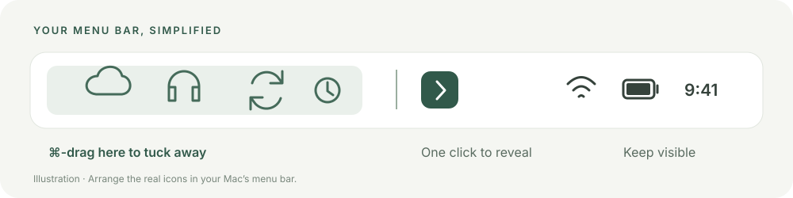

<p align="center">
  
</p>

<h1 align="center">Hidebar</h1>
<p align="center"><strong>A little less clutter. A little more focus.</strong></p>
<p align="center">Keep the menu bar icons you need. Tuck the rest behind a click.</p>

<p align="center">
  <a href="https://github.com/hamidarslan/Hidebar-macOS/releases/tag/v1.3.0"><strong>Download for macOS</strong></a>
  &nbsp; · &nbsp;
  <a href="#make-it-yours">Quick start</a>
  &nbsp; · &nbsp;
  <a href="CHANGELOG.md">What's new</a>
  &nbsp; · &nbsp;
  <a href="https://github.com/hamidarslan/Hidebar-macOS/issues/new/choose">Ideas & feedback</a>
</p>

<p align="center">macOS 14+ · Apple Silicon & Intel · Native SwiftUI + AppKit · MIT License</p>

---

## Download. Drag. Open.

**The download is a complete macOS app. You do not need to install Xcode, Swift, Homebrew, Python, Rosetta on Apple Silicon, or any packages.**

1. Download **[Hidebar 1.3.0.dmg](https://github.com/hamidarslan/Hidebar-macOS/releases/download/v1.3.0/Hidebar-1.3.0-macOS-universal.dmg)**.
2. Open the disk image and drag **Hidebar.app → Applications**.
3. Eject the disk image and open **Hidebar** from Applications.

Prefer a ZIP? [Download the standalone app](https://github.com/hamidarslan/Hidebar-macOS/releases/download/v1.3.0/Hidebar-1.3.0-macOS-universal.zip). Both downloads contain the same universal app, with native Apple Silicon and Intel code. [SHA-256 checksums](https://github.com/hamidarslan/Hidebar-macOS/releases/download/v1.3.0/Hidebar-1.3.0-macOS-universal.sha256) are provided alongside them.

> **Current release:** this is a development preview, locally signed but not notarized by Apple. macOS may warn or block the first launch. This is a signing limitation, not a missing software dependency. The app itself needs no account or internet connection.

## Make it yours

<p align="center"></p>

1. **Open Hidebar.** The setup window reveals your icons while you arrange them.
2. **Hold ⌘ and drag.** In the actual macOS menu bar, move unwanted icons to the **left of the │ divider**. You can move the divider too.
3. **Keep the arrow on the right.** Icons to the right of the divider are the ones you want available.
4. **Click All set.** Click Hidebar's arrow whenever you want to reveal or tuck away icons.

The preview in settings is an illustration; arrange the real icons at the top of your screen. macOS controls which system icons can be moved.

## Small app. Useful details.

| Feature | What it does |
| --- | --- |
| **One-click show/hide** | Switch between a tidy bar and your revealed icons. |
| **Automatic hiding** | Choose 5, 10, 15, 30, or 60 seconds; hiding waits while your pointer is near the menu bar. |
| **Your keyboard shortcut** | Record a Control/Command shortcut; default ⌃⌥H. Unavailable combinations keep the previous shortcut. |
| **Temporary pause** | Keep icons visible for 5 minutes, 1 hour, or until resumed without changing auto-hide preferences. |
| **Guided setup** | An illustrated five-step walkthrough with real hide/reveal trials. |
| **Local troubleshooting** | Review a minimal report and copy it explicitly; nothing is uploaded. |
| **System appearance** | Native light/dark colors and setup transitions that respect Reduce Motion. |
| **Your choice of control** | Use a chevron or a compact dots icon. |
| **Launch at login** | An optional setting using native macOS login-item management. |
| **Start tucked away** | Wait 15 seconds after launch before hiding. |
| **Easy recovery** | Reopen Hidebar from Applications to reveal icons and open settings. |

### Everyday controls

| Action | Control |
| --- | --- |
| Reveal or hide icons | Click the menu bar arrow / dots |
| Toggle from the keyboard | **Control + Option + H** by default; configurable in Settings |
| Open settings | **Option-click** the arrow, or reopen the app |
| More options and quit | **Right-click** the arrow |
| Reveal and stop automatic hiding | Right-click → **Keep visible until resumed** |

### Pause and quick controls

Right-click the arrow for temporary pause, resume, auto-hide delay, auto-hide on/off, settings, and troubleshooting. Timed pauses expire even across sleep; an indefinite pause lasts until resumed or Hidebar quits. Choosing **Hide now** ends a pause. Closing Settings with **All set** preserves an active pause.

### Make the shortcut yours

In Settings, activate **Record**, then press a key with Control or Command. Escape or moving focus cancels recording. The previous registration remains active if macOS rejects a new combination. Conflict detection covers OS-reported registrations, not every app-local or system shortcut; always test your choice. Use **Default** or **Turn off** as needed. A received hotkey event shows “Shortcut received successfully”; registration alone does not prove system delivery. Shortcuts follow physical key positions; rerecord after changing keyboard layouts if the label no longer matches.

### Troubleshooting without uploads

Open **Troubleshooting** to review app/macOS versions, architecture, display count, and Hidebar status. **Copy report** writes only that visible summary to the clipboard. It contains no usernames, paths, display identifiers, configured key contents, or other apps.

## Private by design

Hidebar runs locally. There are no accounts, ads, analytics, background servers, or network requests. Settings stay in the app's sandbox on your Mac. App Sandbox blocks network connections and provides no user-file access grants; Hardened Runtime is enabled. The current feature set does not request Accessibility or Screen Recording permission and does not modify other apps' preferences.

Read the full [privacy policy](PRIVACY.md) or open **Privacy & local data** in Settings to read it offline and reset preferences. The bundled Apple privacy manifest declares no tracking or collected data.

Your apple artwork is used in the app icon and settings. The original is preserved in [`icons.png`](icons.png); the cleaned version has real transparent corners, with the white exterior removed.

## Good to know

- **macOS 27:** displaced icons may appear in the system's **« overflow menu**.
- **Crowded or notched screens:** macOS may not have room to reveal every icon simultaneously.
- **Recovery:** if the arrow is hard to find, reopen Hidebar from Applications. Quit restores the space occupied by Hidebar's divider.
- **Updating:** quit the old copy, replace Hidebar in Applications, and reopen it. Version 1.2.0 introduced sandboxed storage, so older settings may need to be configured again. Later sandboxed updates retain the same preference domain. There is no automatic updater.
- **Removing:** turn off Launch at login, quit Hidebar, and move the app to Trash. See the [privacy policy](PRIVACY.md#retention-reset-and-removal) for local preferences and backup retention.

The release targets macOS 14+, with both CPU architectures included. Local testing used Apple Silicon on macOS 27, including user-confirmed global shortcut activation with Finder focused. Intel, older macOS releases, multiple displays, physical right-click, and a full login cycle still need manual validation. See the [test record](docs/TESTING.md).

## Public source baseline

This repository begins with the source for the v1.3.0 preview. Earlier changelog entries describe product history; earlier Git history and development reviews are not included. The downloadable v1.3.0 app is unchanged. Documentation and repository links have been adapted for this public repository.

## For developers

**This section is for changing the source. It is not required to use the downloaded app.**

Use a Mac and a Swift 6 toolchain (Xcode or Command Line Tools):

```sh
git clone https://github.com/hamidarslan/Hidebar-macOS.git
cd Hidebar-macOS
./script/build_and_run.sh
```

```sh
./script/test.sh                         # Geometry, pause, and shortcut validation tests
./script/test_privacy.sh                 # Runtime sandbox privacy checks
./script/build_and_run.sh --build-only   # Local debug bundle
./script/package.sh                      # Optimized universal app, DMG, ZIP, checksums
./script/verify_bundle.sh dist/Hidebar.app 1
```

Release packaging checks the signature, icon/resources, both architectures, and linked libraries. The app uses system frameworks and any bundled compatibility libraries; it does not load libraries from a developer's Homebrew or project directory. CI repeats the tests and packaging checks on a hosted Mac.

The cleaned PNG and ICNS generator are checked in. The optional `script/clean_icon.py` maintenance tool uses Pillow only when regenerating the artwork; it is not part of app building or execution.

### Keep building on a stable baseline

`main` contains current development. Version tags preserve each release, starting here with **v1.3.0**. Add ideas as issues, use feature branches and pull requests, and record changes in the changelog. Existing tags are never rewritten.

| Guide | Contents |
| --- | --- |
| [Contributing](CONTRIBUTING.md) | Development setup and branch workflow |
| [Architecture](docs/ARCHITECTURE.md) | Components, persistence, and menu bar behavior |
| [Testing](docs/TESTING.md) | Automated checks and manual validation gaps |
| [Releasing](docs/RELEASING.md) | Versions, packaging, signing, and rollbacks |
| [Roadmap](docs/ROADMAP.md) | Priorities and future ideas |
| [Icon tray feasibility](docs/ICON_TRAY_FEASIBILITY.md) | Why searching other apps’ icons needs a separate permission/API design |
| [Security](SECURITY.md) | Enforced boundaries, release gates, and reporting |
| [Privacy](PRIVACY.md) | Local data, permissions, retention, and removal |

---

<p align="center">Made by Arslan Hamid · <a href="LICENSE">MIT License</a> · <a href="THIRD_PARTY_NOTICES.md">Acknowledgments</a></p>
